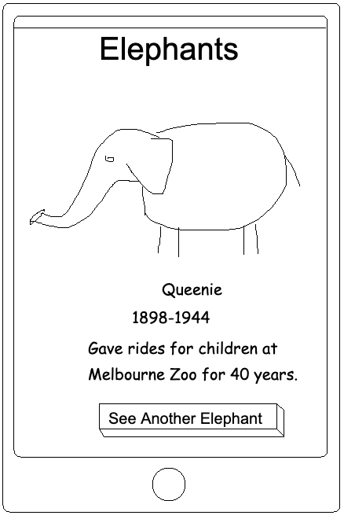
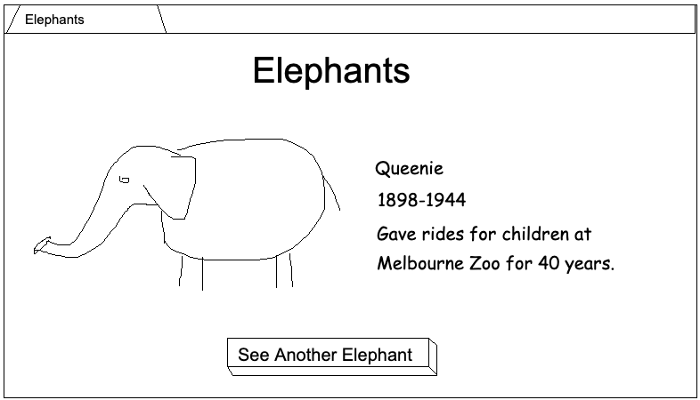

Elephants
=========

We have a client who would like a simple web page that displays information
about elephants, with a random elephant shown each time. The client has
given us some basic mockups:

### Mobile

### Desktop

Requirements
------------

The customer would like the following on their new web page:

* Query the **Elephant API** to get an elephant
* Display the elephant's name, date of birth and death, and note
* If the elephant's details includes an image, display it
* There should be a button which loads a new elephant, without reloading the
whole page.
* The UI on desktop and mobile should use the screen space well - see the specs above for a suggestion
* A "dark mode" toggle should allow the user to switch colour schemes
* Handle any unexpected responses from the API

Please avoid the use of any JS or CSS frameworks (unless you've been told
otherwise by us), ensure the page loads quickly, and follow best practices
for code quality. The client does have a modern browser, so don't worry about
backwards compatibility.

Elephant API
------------

The API is a little slow, and not always reliable, but simple to use:

* `GET https://star-busy-ankle.glitch.me` returns information on a random elephant.

